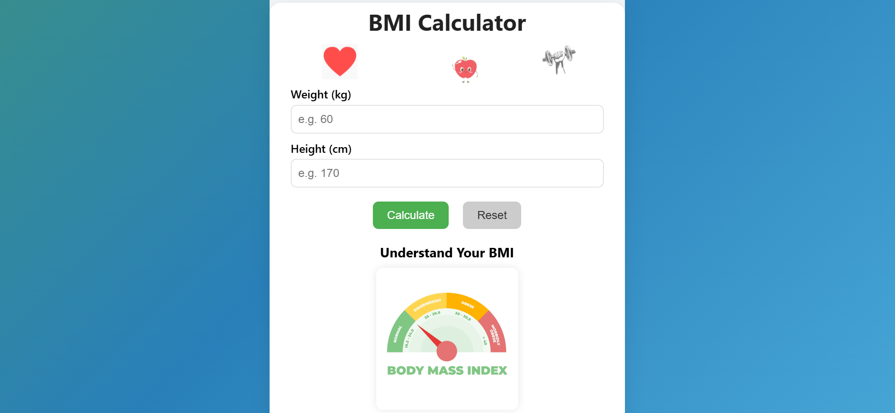

# 💪 BMI Calculator Web App

This is a stylish and interactive **BMI (Body Mass Index) Calculator** built using **ReactJS**, **HTML**, **CSS**, and **JavaScript**. The app allows users to input their height and weight, and calculates their BMI along with a categorized health suggestion. It also includes a BMI chart and the option to print/download the result.

## 🚀 Features

- 🧮 Real-time BMI calculation
- 🟢 Health category output (Underweight, Normal, Overweight, Obese)
- 🎨 Animated gradient background
- 🖼️ Floating health icons (Heart, Apple, Dumbbell)
- 📈 BMI chart for reference
- 🖨️ Print or download report
- 📱 Responsive design for mobile and desktop

## 📸 Screenshot

## 🛠️ Tech Stack

- ReactJS (Functional Components & Hooks)
- HTML5
- CSS3 (Animations, Media Queries)
- JavaScript (ES6+)

## 📂 Folder Structure
project-folder/
├── public/
│ ├── icons/
│ │ ├── heart.png
│ │ ├── apple.png
│ │ └── dumbbell.png
│ └── bmi.webp
├── src/
│ ├── App.js
│ └── App.css
└── README.md
